<!-- omit in toc -->
# IoT End-2-End Architecture Design

<!-- omit in toc -->
# Table of Contents

- [Scenario 1 - Personal Health Device \& Monitoring System](#scenario-1---personal-health-device--monitoring-system)
  - [High-Level Architecture \& Main Components](#high-level-architecture--main-components)
  - [Data Models](#data-models)
  - [Protocols \& Communication](#protocols--communication)
    - [MQTT Topics \& Data](#mqtt-topics--data)
    - [MQTT Topics \& Service Mapping](#mqtt-topics--service-mapping)
- [Scenario 2 - Health \& Sport](#scenario-2---health--sport)
  - [High-Level Architecture \& Main Components](#high-level-architecture--main-components-1)
  - [Interactions \& Data Flows](#interactions--data-flows)
  - [Data Models](#data-models-1)
  - [Protocols \& Communication](#protocols--communication-1)
    - [MQTT Topics \& Data](#mqtt-topics--data-1)
    - [MQTT \& Service Mapping](#mqtt--service-mapping)
    - [HTTP RESTful APIs](#http-restful-apis)
  - [Protocols \& Communication Alternative - MQTT + CoAP + HTTP](#protocols--communication-alternative---mqtt--coap--http)
  - [Protocols \& Communication Alternative - CoAP + HTTP](#protocols--communication-alternative---coap--http)
- [Scenario 3 - Industrial Remote Telemetry](#scenario-3---industrial-remote-telemetry)
  - [High-Level Architecture \& Main Components](#high-level-architecture--main-components-2)
  - [Data Models](#data-models-2)
  - [Protocols \& Communication](#protocols--communication-2)
    - [MQTT Topics \& Data](#mqtt-topics--data-2)
    - [MQTT Topics \& Service Mapping](#mqtt-topics--service-mapping-1)
  - [Dual-Broker Architecture](#dual-broker-architecture)

---

# Scenario 1 - Personal Health Device & Monitoring System

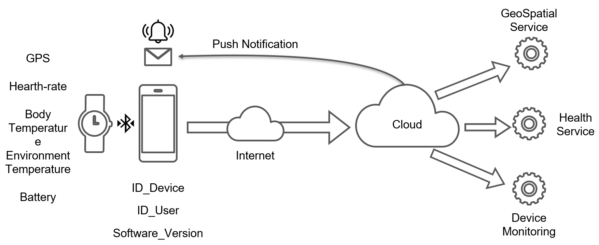

**Figure 1:** Schematic representation of a Personal Health Device & Monitoring System with high-level components and interactions.

A distributed IoT health monitoring solution for continuous personal health tracking. Wearable devices capture biometric and contextual data (heart rate, body temperature, environmental temperature, GPS, battery), relay them via a smartphone to cloud microservices for ingestion, processing, storage, analytics, and real-time notifications. The design supports reliability, security, and scalability across multiple users and devices.

---

## High-Level Architecture & Main Components

- **Edge Layer (Wearable IoT Device)**
  - Sensors:
    - **GPS**: user location for activity and emergency context
    - **Heart Rate**: cardiovascular monitoring and anomaly detection
    - **Body Temperature**: thermal health status
    - **Environmental Temperature**: ambient context enrichment
    - **Battery Level**: device health and lifecycle

- **Connectivity Layer (Smartphone + Network)**
  - **BLE** link to wearable
  - **Wi‑Fi/Mobile data** uplink to cloud

- **Cloud Layer**
  - **GeoSpatial Service**: GPS ingestion, map-matching, geofencing, activity context
  - **Health Service**: biometric processing, anomaly detection, trends, alerts
  - **Device Monitoring Service**: fleet management, OTA updates, device health
  - **Notification Service**: push messages and alerts to mobile apps (e.g., through platform specific services like Android or iOS push notification services)


## Data Models

Each sensor reading is modeled as an independent entity with its own schema, optimized for the specific microservice that will process it.
In all data models, timestamps are represented as Unix epoch time in milliseconds for consistency and ease of temporal correlation across different data types.
The presence of the timestamp field in each data model is crucial for enabling time-series analysis, trend detection, and correlation of events across different sensor types.
Furthermore, including a timestamp allows the system to handle out-of-order (or duplicated) data arrivals, which is common in distributed systems, by providing a temporal context for each reading.

**GPS Data Model**

Designed for the **GeoSpatial Service** to handle location tracking, geofencing, and activity mapping.

| **Field** | **Type** | **Description** |
|-----------|----------|-----------------|
| `latitude` | Double | Latitude coordinate |
| `longitude` | Double | Longitude coordinate |
| `altitude` | Double | Elevation above sea level (meters) |
| `timestamp` | Long | Unix epoch timestamp (ms) |


**Heart-rate Data Model**

Designed for the **Health Service** to monitor cardiovascular health and detect anomalies.

| **Field** | **Type** | **Description** |
|-----------|----------|-----------------|
| `value` | Double | Heart rate measurement |
| `unit` | String | Unit of measure (e.g., "bpm") |
| `timestamp` | Long | Unix epoch timestamp (ms) |


**Body Temperature Data Model**

Designed for the **Health Service** to detect fever, hypothermia, and health trends.

| **Field** | **Type** | **Description** |
|-----------|----------|-----------------|
| `value` | Double | Body temperature measurement |
| `unit` | String | Unit of measure (e.g., "Celsius", "Fahrenheit") |
| `timestamp` | Long | Unix epoch timestamp (ms) |


**Environmental Temperature Data Model**

Designed for **contextual enrichment** in both GeoSpatial and Health Services.

| **Field** | **Type** | **Description** |
|-----------|----------|-----------------|
| `value` | Double | Ambient temperature measurement |
| `unit` | String | Unit of measure (e.g., "Celsius") |
| `timestamp` | Long | Unix epoch timestamp (ms) |

**Battery Data Model**

Designed for the **Device Monitoring Service** to manage device health and lifecycle.

| **Field**     | **Type**   | **Description**              |
|----------|--------|--------------------------|
| `value`   | Double | Battery level (0-100%)   |
| `timestamp` | Long   | Unix epoch timestamp (ms) |

**Device Info Data Model**

Designed as **metadata** for all microservices to trace device and user context.

| **Field** | **Type** | **Description** |
|-----------|----------|-----------------|
| `id` | String | Unique device identifier (UUID) |
| `user_id` | String | Unique user identifier (UUID) |
| `software_version` | String | Firmware/software version (e.g., "1.2.3") |

---

## Protocols & Communication

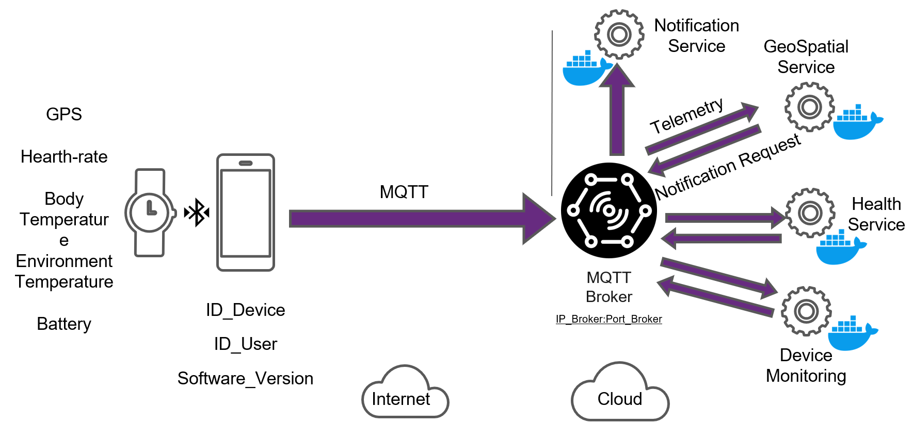

**Figure 2:** Mapping of the MQTT protocol on the target scenario with the broker and the main data flows.

The target scenario in mainly associated to the concept of **Telemetry Data Ingestion** from edge devices to cloud services with a few messages coming from the cloud to the edge associated to 
**notification** messages. In this context, the MQTT protocol is a perfect fit due to its lightweight nature, publish-subscribe model, and efficiency in handling intermittent connectivity common in IoT environments.

The Figure 2 shows how the MQTT protocol can be mapped on the target scenario with the broker and the main data flows. In this case, the MQTT broker can be hosted in the cloud since the main data flows are from the edge to the cloud and edge devices are connected via smartphone with internet access and the broker can be reached without problems. A deployment where the broker is hosted on the edge could be considered in scenarios where edge devices are connected via local network without internet access or with limited connectivity.

The same scenario can be also implemented with other protocols such a request/response solution (e.g., HTTP or CoAP) depending on specific requirements and constraints. 
However, MQTT is configuration associated mainly to a pub/sub interaction and a telemetry driven application scenario and the need of decoupling between data producers (edge devices) and data consumers (cloud services) makes MQTT a more suitable choice.

### MQTT Topics & Data

In this section, the MQTT topics and the associated data payloads for each sensor type are defined. The topics are structured to facilitate easy subscription and filtering by the respective microservices in the cloud.

**Device Info Topic**

- **Topic**: `devices/{device_id}/info`
- **Payload**:
  ```json
  {
    "id": "string",
    "user_id": "string",
    "software_version": "string"
  }
  ```
- **QoS Level**: 2 (ensures exactly once delivery for critical metadata)
- **Retain Flag**: true (to keep the latest device info available for new subscribers)

With this setup, each microservice can subscribe to the relevant topics to receive real-time data from the wearable devices, enabling efficient processing and analysis tailored to their specific functions. Furthermore, the usage of a retain flag for the device info topic ensures that new microservices or instances can quickly obtain the latest device metadata without waiting for the next update from the edge device.

**GPS Data Topic**

- **Topic**: `devices/{device_id}/telemetry/gps`
- **Payload SenML+JSON**:
  ```json
  [
    {
      "n": "iot.data.gps.latitude",
      "u": "lat",
      "v": double,
      "t": long
    },
    {
      "n": "iot.data.gps.longitude",
      "u": "lon",
      "v": double,
      "t": long
    },
    {
      "n": "iot.data.gps.altitude",
      "u": "alt",
      "v": double,
      "t": long
    }
  ]
  ```
- **QoS Level**: 1 (ensures at least once delivery for location data)
- **Retain Flag**: false (location data is time-sensitive and should not be retained

This topic configuration allows the GeoSpatial Service to efficiently receive and process GPS data for real-time location tracking and geofencing.
The QoS level of 1 balances reliability with performance, ensuring that location updates are delivered without overwhelming the network.
In case of an higher frequency data generation, a QoS level of 0 could be considered to further reduce network load, accepting the possibility of occasional data loss.
With QoS level 1, duplicate messages may be received, so the interested Services should implement idempotent processing to handle potential duplicates.
The retain flag is set to false to prevent outdated location data from being sent to subscribers.

**Heart-rate Data Topic**

- **Topic**: `devices/{device_id}/telemetry/heart_rate`
- **Payload SenML+JSON**:
  ```json
  [
    {
      "n": "iot.data.heart_rate",
      "u": "bpm",
      "v": double,
      "t": long
    }
  ]
  ```
- **QoS Level**: 1 (ensures at least once delivery for health data)
- **Retain Flag**: false (heart rate data is time-sensitive and should not be retained)

This topic configuration allows the Health Service to efficiently receive and process heart rate data for real-time health monitoring and anomaly detection.
The QoS level of 1 balances reliability with performance, ensuring that heart rate updates are delivered without overwhelming the network.
In case of an higher frequency data generation, a QoS level of 0 could be considered to further reduce network load, accepting the possibility of occasional data loss.
With QoS level 1, duplicate messages may be received, so the interested Services should implement idempotent processing to handle potential duplicates.
The retain flag is set to false to prevent outdated health data from being sent to subscribers.

**Body Temperature Data Topic**

- **Topic**: `devices/{device_id}/telemetry/body_temperature`
- **Payload SenML+JSON**:
  ```json
  [
    {
      "n": "iot.data.body_temperature",
      "u": "Cel",
      "v": double,
      "t": long
    }
  ]
  ```
- **QoS Level**: 1 (ensures at least once delivery for health data)
- **Retain Flag**: false (body temperature data is time-sensitive and should not be retained)

This topic configuration allows the Health Service to efficiently receive and process body temperature data for real-time health monitoring.
The QoS level of 1 balances reliability with performance, ensuring that body temperature updates are delivered without overwhelming the network.
In case of an higher frequency of body temperature data generation, a QoS level of 0 could be considered to further reduce network load, accepting the possibility of occasional data loss.
With QoS level 1, duplicate messages may be received, so the interested Services should implement idempotent processing to handle potential duplicates.
The retain flag is set to false to prevent outdated health data from being sent to subscribers.

**Environmental Temperature Data Topic**

- **Topic**: `devices/{device_id}/telemetry/environmental_temperature`
- **Payload SenML+JSON**:
  ```json
  [
    {
      "n": "iot.data.environmental_temperature",
      "u": "Cel",
      "v": double,
      "t": long
    }
  ]
  ```
- **QoS Level**: 1 (ensures at least once delivery for contextual data)
- **Retain Flag**: false (environmental temperature data is time-sensitive and should not be retained)

This topic configuration allows both the GeoSpatial and Health Services to efficiently receive and process environmental temperature data for contextual enrichment.
The QoS level of 1 balances reliability with performance, ensuring that environmental temperature updates are delivered without overwhelming the network.
In case of an higher frequency data generation, a QoS level of 0 could be considered to further reduce network load, accepting the possibility of occasional data loss.
With QoS level 1, duplicate messages may be received, so the interested Services should implement idempotent processing to handle potential duplicates.
The retain flag is set to false to prevent outdated contextual data from being sent to subscribers.

**Notification Topic**

- **Topic**: `devices/{device_id}/notification`
- **Payload**:
  ```json
  {
    "message": "string",
    "timestamp": long
  }
  ```
- **QoS Level**: 2 (ensures exactly once delivery for critical notifications)
- **Retain Flag**: false (notifications are time-sensitive and should not be retained)

This topic configuration allows the Notification Service to efficiently send real-time alerts and messages to the wearable devices via the smartphone.
The QoS level of 2 ensures that critical notifications are delivered exactly once, preventing duplicates that could confuse users.
The retain flag is set to false to ensure that notifications are only delivered when they are relevant and timely.

---

### MQTT Topics & Service Mapping

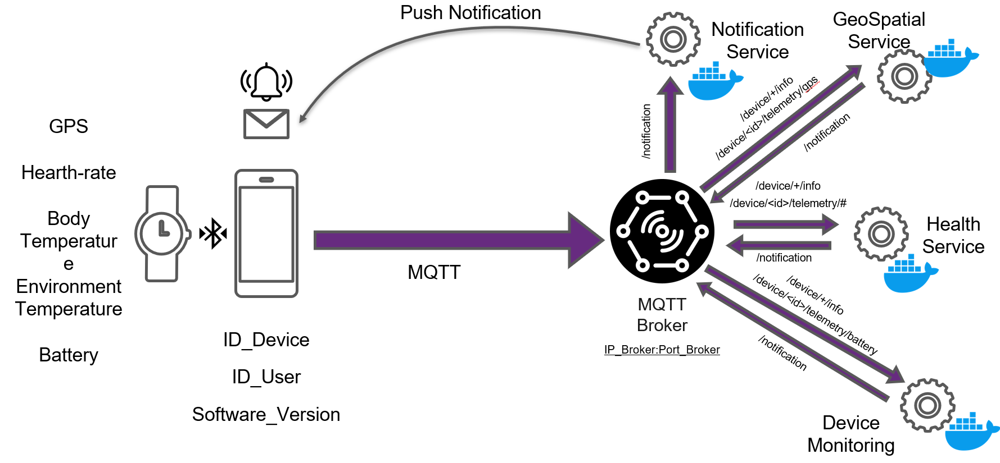

**Figure 3:** Association of the different MQTT topics with the corresponding services in the target scenario.

Once the MQTT topics and their configurations are defined, they can be mapped to the respective microservices in the cloud architecture as shown in Figure 3.
This mapping is strategic for the scenario design, as it ensures that each microservice subscribes only to the topics relevant to its functionality, optimizing resource usage and processing efficiency.

In particular we have the mapping described and summarized below:


| Topic / Pattern                     | Purpose                               | Publisher                       | Subscriber(s)                 | Notes |
|-------------------------------------|---------------------------------------|---------------------------------|--------------------------------|-------|
| `device/+/info`                     | Device metadata (id, user, sw)        | Edge device (wearable/phone)    | Health, Device Monitoring      | Retained for late subscribers |
| `device/<id>/telemetry/#`           | All telemetry from a device           | Edge device (wearable/phone)    | Health (generic ingest)        | Use when a service wants all signals |
| `device/<id>/telemetry/gps`         | GPS location stream                   | Edge device (wearable/phone)    | GeoSpatial Service             | High-frequency; QoS 1 |
| `device/<id>/telemetry/heart_rate`  | Heart-rate stream                     | Edge device (wearable/phone)    | Health Service                 | QoS 1; idempotent processing |
| `device/<id>/telemetry/body_temperature` | Body temperature stream          | Edge device (wearable/phone)    | Health Service                 | QoS 1 |
| `device/<id>/telemetry/environmental_temperature` | Ambient temp stream          | Edge device (wearable/phone)    | Health, GeoSpatial             | Context enrichment |
| `device/<id>/telemetry/battery`     | Battery level                         | Edge device (wearable/phone)    | Device Monitoring              | Drives alerts/maintenance |
| `device/<id>/notification`          | Downlink app/wearable notifications   | Notification Service            | Mobile app / wearable client   | QoS 2 for critical alerts |
| `notification` (service→service)    | Cloud notification requests/events    | Health, GeoSpatial, Device Monitoring | Notification Service      | Internal fan-in/fan-out via broker |

In particular it is important to highlight the following aspects:

- The use of wildcards (`+` and `#`) in topics allows for flexible subscription patterns, enabling services to subscribe to multiple related topics without needing to specify each one individually.
- The QoS levels are chosen based on the criticality and frequency of the data, balancing reliability with network efficiency.
- The retain flag is used judiciously to ensure that only relevant and timely data is delivered to subscribers, preventing outdated information from causing confusion or errors.
- The notification topic is designed for downlink communication from the cloud to the edge devices, ensuring that users receive timely alerts and messages.
- The Notification Service acts as a centralized hub for sending notifications, receiving requests from multiple services and dispatching them to the appropriate devices.

---

# Scenario 2 - Health & Sport

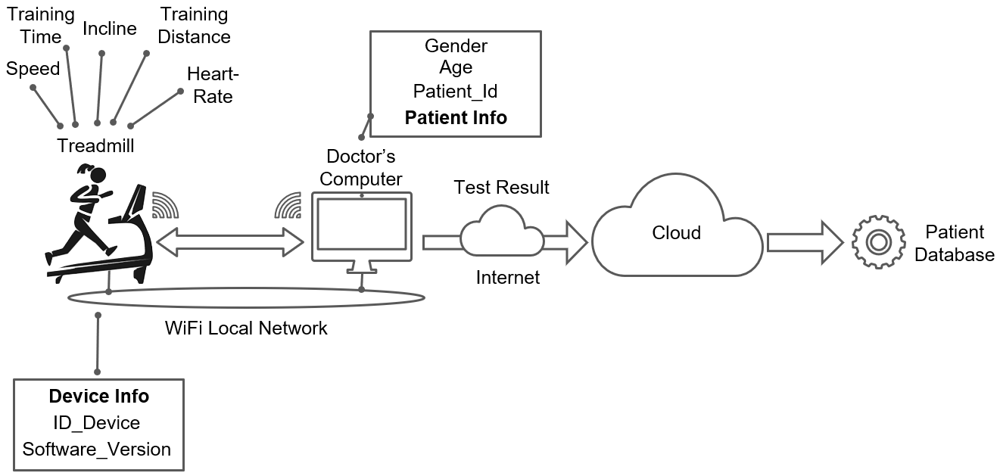

**Figure 4:** Schematic representation of a Health & Sport monitoring system with high-level components and interactions.

In this second scenario an IoT helth and monitoring for testing sports athletes is considered. 
This scenario depicts an **IoT-enabled fitness ecosystem** that integrates smart exercise equipment with cloud-based health analytics and medical record management. 
The system enables real-time monitoring of workout performance, integration with patient medical profiles, and long-term health trend analysis.

---

## High-Level Architecture & Main Components

The main components of the target scenario are:

- **Edge Layer (Smart Exercise Equipment)**

  - **Treadmill** with the following sensors, actuators and device information:
    - **Sensors:**
      - Speed Sensor: measures the speed of the treadmill belt
      - Incline Sensor: measures the incline angle of the treadmill
      - Heart Rate Monitor: tracks the user's heart rate during exercise
      - Distance Sensor: measures the distance covered during the workout
      - Training Time: tracks the duration of the workout session
    - **Actuators:**
      - Speed Control: adjusts the speed of the treadmill belt
      - Incline Control: adjusts the incline angle of the treadmill
    - **Device Info:**
      - Device ID: unique identifier for the treadmill
      - Software Version: firmware/software version of the treadmill
  - **Doctor's Computer** to access patient medical records, receive telemetry data, and send test results to the cloud services. Available information about the patient are:
    - Patient ID: unique identifier for the patient
    - Gender: Gender of the patient
    - Age: Age of the patient
  - **Local Network Connectivity**: connects the treadmill and doctor's computer to the cloud services via Wi-Fi or Ethernet.

- **Cloud Layer**
  - **Patient Database Service**: manages patient profiles, medical history, and demographics.
  - **Results Database Service**: stores workout results, health metrics, and test outcomes.

---

## Interactions & Data Flows

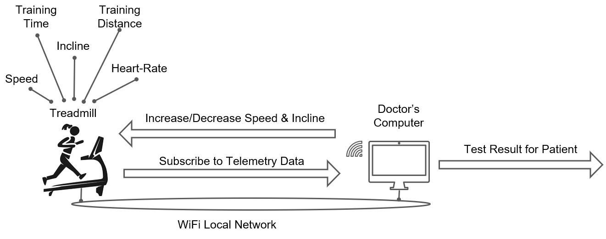

**Figure 5:** Local interaction between the treadmill and the doctor's computer with the main associated actions.

The figure illustrates the synchronous and real-time interaction between the connected treadmill and the doctor's computer within a localized WiFi network environment. 
The treadmill continuously streams telemetry data to the doctor's computer that is subscribed to receive and process this data in real-time. 
The doctor can monitor the patient's performance metrics, such as speed, incline, heart rate, distance. Furthermore the doctor through the computer can send commands to the treadmill to adjust workout parameters based on the patient's performance and health status.

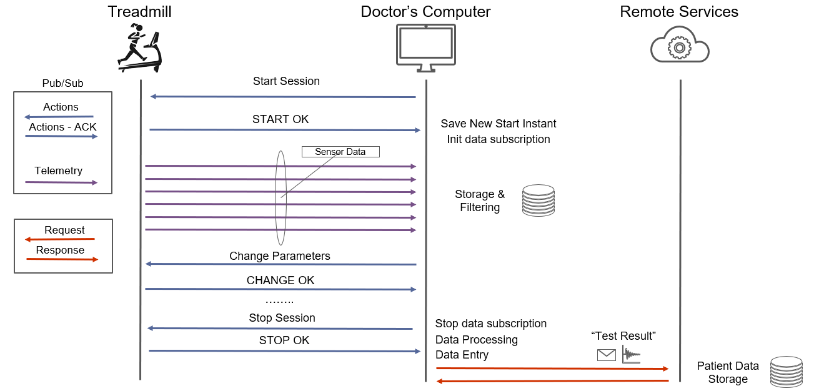

**Figure 6:** Detailed interaction between the treadmill and the doctor's computer and also the cloud services.

As illustrated in the previous figure, in this scenario we can have two main interaction patterns: 

- **Publish/Subscribe Interaction**:
  - Treadmill → Doctor's Computer:
    - Start a new test session
    - Stop the current test session
    - Adjust treadmill settings (speed, incline etc ..) in order to adapt the workout to the patient's condition
  - Treadmill → Doctor's Computer:
    - Telemetry Data Stream: continuous streaming of workout metrics (speed, incline, heart rate, distance, training time)
- **Request/Response Interaction**:
  - Doctor's Computer → Cloud Services:
    - Send patient information to the Patient Database Service
    - Send test results to the Results Database Service

---

## Data Models

**Heart Rate Data Model**

Captures real-time cardiovascular response during exercise sessions. 
Used by the doctor's computer for immediate supervision and by cloud services for long-term health trend analysis.

| **Field** | **Type** | **Description** |
|-----------|----------|-----------------|
| `value` | Double | Heart rate measurement in beats per minute (bpm) |
| `unit` | String | Unit of measure (typically "bpm") |
| `timestamp` | Long | Unix epoch timestamp (ms) indicating when the reading was taken |

**Speed Data Model**

Represents the treadmill belt speed during exercise. 
Critical for workout intensity assessment and correlation with cardiovascular response.

| **Field** | **Type** | **Description** |
|-----------|----------|-----------------|
| `value` | Double | Treadmill belt speed measurement |
| `unit` | String | Unit of measure (e.g., "km/h", "mph") |
| `timestamp` | Long | Unix epoch timestamp (ms) indicating when the reading was taken |

**Incline Data Model**

Captures the treadmill slope angle during exercise. Used to calculate exercise intensity and resistance level.

| **Field** | **Type** | **Description** |
|-----------|----------|-----------------|
| `value` | Double | Incline angle measurement |
| `unit` | String | Unit of measure (e.g., "degrees", "percentage") |
| `timestamp` | Long | Unix epoch timestamp (ms) indicating when the reading was taken |

**Training Info Data Model**

Aggregates session-level workout information. Provides a summary of the exercise session for medical assessment and historical record-keeping.

| **Field** | **Type** | **Description** |
|-----------|----------|-----------------|
| `start_timestamp` | Long | Unix epoch timestamp (ms) indicating session start time |
| `end_timestamp` | Long | Unix epoch timestamp (ms) indicating session end time |
| `distance` | Double | Total distance covered during the session |
| `distance_unit` | String | Unit of measure for distance (e.g., "km", "miles") |

Derived Metrics:
- Session duration: `end_timestamp - start_timestamp`
- Average speed: `distance / session_duration`
- Workout intensity profile: correlation with heart rate trends


**Device Info Data Model**

Contains metadata about the treadmill device. Used for device fleet management, troubleshooting, and compatibility tracking.

| **Field** | **Type** | **Description** |
|-----------|----------|-----------------|
| `id` | String | Unique device identifier (UUID) for the treadmill |
| `software_version` | String | Firmware/software version (e.g., "2.1.5") |
| `manufacturer` | String | Device manufacturer name (e.g., "TechnoGym", "Life Fitness") |
| `device_type` | String | Type of exercise equipment (e.g., "treadmill", "elliptical") |

**Patient Info Data Model**

Stores demographic and clinical information about the patient undergoing the exercise test. Used to contextualize workout data and apply age/gender-specific health guidelines.

| **Field** | **Type** | **Description** |
|-----------|----------|-----------------|
| `id` | String | Unique patient identifier (UUID) |
| `gender` | String | Patient gender (e.g., "Male", "Female", "Other") |
| `age` | Integer | Patient age in years |

**Test Result Data Model**

Aggregates and summarizes the complete exercise test session. Generated by the doctor's computer and stored in the cloud Results Database Service for long-term medical record-keeping and trend analysis.

| **Field** | **Type** | **Description** |
|-----------|----------|-----------------|
| `id` | String | Unique test result identifier (UUID) |
| `timestamp` | Long | Unix epoch timestamp (ms) of test completion |
| `avg_hr` | Double | Average heart rate throughout the session (bpm) |
| `is_success` | Boolean | Indicator of whether the test was completed successfully |
| `hr_graph_data` | Array[...] | Time-series array of heart rate readings for graphical visualization |
| `conf_data` | Array[...] | Configuration data (speed/incline profiles, test protocol parameters) |

---

## Protocols & Communication

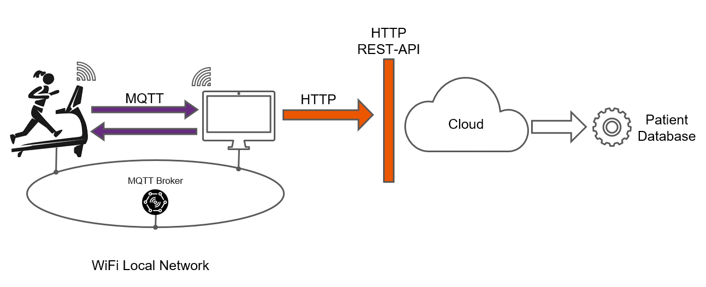

**Figure 7:** Identifed protocols and communication patterns in the target scenario through HTTP and MQTT.

Since the target scenario involves both synchronous request/response interactions and real-time telemetry streaming, a hybrid communication approach is adopted using HTTP and MQTT protocols.

In particular:

- **HTTP** is used for request/response interactions between the doctor's computer and cloud services. This includes sending patient information to the Patient Database Service and submitting test results to the Results Database Service. HTTP is well-suited for these operations due to its widespread adoption, ease of use, and support for structured data formats like JSON.
- **MQTT** is employed for real-time telemetry data streaming from the treadmill to the doctor's computer. The publish/subscribe model of MQTT allows for efficient, low-latency transmission of continuous data streams such as heart rate, speed, and incline metrics. This is crucial for real-time monitoring during exercise sessions. The same protocol can be also used for sending control commands from the doctor's computer to the treadmill to start/stop sessions and adjust settings.

### MQTT Topics & Data

In this section, the MQTT topics and the associated data payloads for each telemetry type and control command are defined. The topics are structured to facilitate easy subscription and filtering by the doctor's computer.

**Heart Rate Data Topic**

- **Topic**: `treadmill/{device_id}/telemetry/heart_rate`
- **Payload SenML+JSON**:
  ```json
  [
    {
      "n": "iot.data.heart_rate",
      "u": "bpm",
      "v": double,
      "t": long
    }
  ]
  ```
- **QoS Level**: 2 (ensures exactly once delivery for critical health data, we want to avoid duplicates and data loss)
- **Retain Flag**: false (heart rate data is time-sensitive and should not be retained)

With this setup, the doctor's computer can subscribe to the heart rate topic to receive real-time updates during the exercise session.
The QoS level of 2 ensures that each heart rate reading is delivered exactly once, which is crucial for accurate health monitoring and analysis.
The retain flag is set to false to prevent outdated heart rate data from being sent to the doctor's computer.

**Speed Data Topic**

- **Topic**: `treadmill/{device_id}/telemetry/speed`
- **Payload SenML+JSON**:
  ```json
  [
    {
      "n": "iot.data.speed",
      "u": "m/s",
      "v": double,
      "t": long
    }
  ]
  ```
- **QoS Level**: 2 (ensures exactly once delivery for critical speed data, we want to avoid duplicates and data loss)
- **Retain Flag**: false (speed data is time-sensitive and should not be retained)

This topic configuration allows the doctor's computer to efficiently receive and process speed data for real-time monitoring of the workout session.
The QoS level of 2 ensures that each speed reading is delivered exactly once, which is crucial for accurate performance assessment.
The retain flag is set to false to prevent outdated speed data from being sent to the doctor's computer

**Incline Data Topic**
- **Topic**: `treadmill/{device_id}/telemetry/incline`
- **Payload SenML+JSON**:
  ```json
  [
    {
      "n": "iot.data.incline",
      "u": "degrees",
      "v": double,
      "t": long
    }
  ]
  ```
- **QoS Level**: 2 (ensures exactly once delivery for critical incline data, we want to avoid duplicates and data loss)
- **Retain Flag**: false (incline data is time-sensitive and should not be retained)

This topic configuration allows the doctor's computer to efficiently receive and process incline data for real-time monitoring of the workout session.
The QoS level of 2 ensures that each incline reading is delivered exactly once, which is crucial for accurate performance assessment.
The retain flag is set to false to prevent outdated incline data from being sent to the doctor's computer.

**Device Info Topic**

- **Topic**: `treadmill/{device_id}/info`
- **Payload**:
  ```json
  {
    "id": "string",
    "software_version": "string",
    "manufacturer": "string",
    "device_type": "string"
  }
  ```
- **QoS Level**: 2 (ensures exactly once delivery for critical metadata)
- **Retain Flag**: true (to keep the latest device info available for new subscribers)

With this setup, the doctor's computer can subscribe to the device info topic to obtain metadata about the treadmill.
The QoS level of 2 ensures that the device information is delivered exactly once, which is crucial for accurate device identification and management.
The retain flag is set to true to ensure that the latest device information is always available to the doctor's computer even if it subscribes after the initial publication or a device or applications reboot.

**Control Command Topic (Speed & Incline)**

- **Topic**: `treadmill/{device_id}/speed` or `treadmill/{device_id}/incline`
- **Payload**:
  ```json
  {
    "value": double,
    "unit": "string"
  }
  ``` 
- **QoS Level**: 2 (ensures exactly once delivery for control commands)
- **Retain Flag**: false (commands are time-sensitive and should not be retained)

These topics allow the doctor's computer to send control commands to the treadmill to adjust speed and incline settings during the workout session.
The QoS level of 2 ensures that each command is delivered exactly once, preventing duplicate adjustments that could confuse the user or disrupt the workout.
The retain flag is set to false to ensure that commands are only executed when they are relevant and timely.

---

### MQTT & Service Mapping

Once the MQTT topics and their configurations are defined, they can be mapped to the respective microservices in the cloud architecture as shown in Figure 3.
This mapping is strategic for the scenario design, as it ensures that each microservice subscribes only to the topics relevant to its functionality, optimizing resource usage and processing efficiency.

In particular we have the mapping described and summarized below:

| Topic / Pattern                             | Purpose                               | Publisher                       | Subscriber(s)                 | Notes |
|---------------------------------------------|---------------------------------------|---------------------------------|--------------------------------|-------|
| `treadmill/+/info`                         | Device metadata (id, sw, manufacturer) | Treadmill                       | Doctor's Computer             | Retained for late subscribers |
| `treadmill/<id>/telemetry/#`               | All telemetry from a treadmill           | Treadmill                       | Doctor's Computer              | Use when a service wants all signals |
| `treadmill/<id>/telemetry/heart_rate`      | Heart-rate stream                     | Treadmill                       | Doctor's Computer              | QoS 2; idempotent processing |
| `treadmill/<id>/telemetry/speed`           | Speed stream                         | | Treadmill                       | Doctor's Computer              | QoS 2; idempotent processing |
| `treadmill/<id>/telemetry/incline`         | Incline stream                       | Treadmill                       | Doctor's Computer              | QoS 2; idempotent processing |
| `treadmill/<id>/speed`                      | Speed control command                 | Doctor's Computer              | Treadmill                      | QoS 2 for critical commands |
| `treadmill/<id>/incline`                    | Incline control command               | | Doctor's Computer              | Treadmill                      | QoS 2 for critical commands |

---

### HTTP RESTful APIs 

In this section, the RESTful APIs for interacting with the Patient Database Service and Results Database Service are defined.

**Base URL:** /sporthealth/api

**Patient APIs**

- GET /patient
  - Description: Retrieve the list of all patients.
  - Response: 200 OK, array of Patient Info objects.
- POST /patient
  - Description: Create a new patient profile.
  - Request: Patient Info payload.
  - Response: 201 Created, created Patient Info object.

- GET /patient/{patient_id}
  - Description: Get detailed data for a specific patient.
  - Response: 200 OK, Patient Info object; 404 Not Found if missing.
- PUT /patient/{patient_id}
  - Description: Update an existing patient profile.
  - Request: Patient Info payload (full or partial).
  - Response: 200 OK, updated Patient Info object; 404 Not Found if missing.
- DELETE /patient/{patient_id}
  - Description: Remove an existing patient.
  - Response: 204 No Content; 404 Not Found if missing.

An example of a Patient Info object:

```json
{
  "patient_id": "0001",
  "name": "Marco", 
  "surname": "Rossi", 
  "age": 35
}
```

**Test Result APIs**

- GET /patient/{patient_id}/results
  - Description: Retrieve all completed test results for a patient.
  - Response: 200 OK, array of Test Result objects.
- POST /patient/{patient_id}/results
  - Description: Create a new test result for a patient.
  - Request: Test Result payload.
  - Response: 201 Created, created Test Result object.

- GET /patient/{patient_id}/results/{result_id}
  - Description: Load detailed data for a specific result.
  - Response: 200 OK, Test Result object; 404 Not Found if missing.
- PUT /patient/{patient_id}/results/{result_id}
  - Description: Update data for a specific result.
  - Request: Test Result payload (full or partial).
  - Response: 200 OK, updated Test Result object; 404 Not Found if missing.
- DELETE /patient/{patient_id}/results/{result_id}
  - Description: Remove a specific result.
  - Response: 204 No Content; 404 Not Found if missing.

An example of a Test Result object keeping the information about heart rate graph data and configuration data can be:

```json
{
  "patient_id": "0001",
  "timestamp": 1578210921,
  "doctor_id": "d0001", 
  "device_id": "treadmill-id-00001",
  "is_success": true,
  "avg_hr": 160,
  "hr_graph_data": [
    {
       "timestamp": 1572121902,
       "hr_value_bpm": 140
    }, 
    {
       "timestamp": 1572121912,
       "hr_value_bpm": 141
    },
    {
       "timestamp": 1572121922,
       "hr_value_bpm": 142
    }
  ],
  "conf_data": [
     {
        "timestamp": 1572121902, 
        "speed_value": 8,
        "incline_value": 0
     }, 
     {
        "timestamp": 1572141902, 
        "speed_value": 14,
        "incline_value": 3
     }
  ]
}
```

**Note**: Payload for the RESTful APIs are represented in JSON format for easy integration and interoperability. Also in this case SenML+JSON format can be used for telemetry data if needed.

---

## Protocols & Communication Alternative - MQTT + CoAP + HTTP

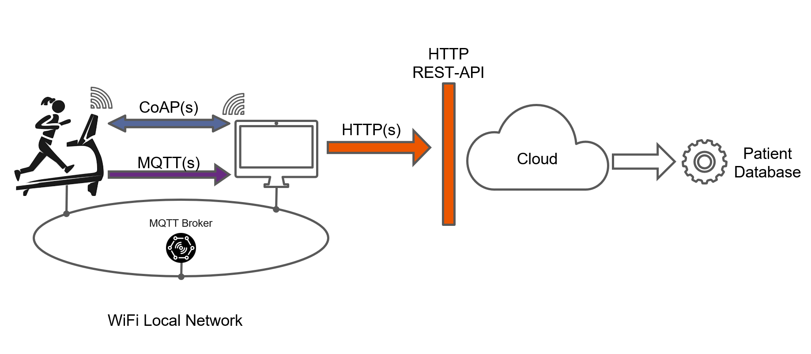

**Figure 8:** The same scenario implemented with MQTT, CoAP and HTTP protocols.

An alternative implementation of the same scenario can be done with a combination of MQTT, CoAP and HTTP protocols as illustrated in the associated Figure.
In particular the local interaction between the treadmill and the doctor's computer can be implemented combining CoAP for the request/response interactions and MQTT for the publish/subscribe telemetry data streaming.

The updated interactions and sequence of operations are depicted in the following Figure.

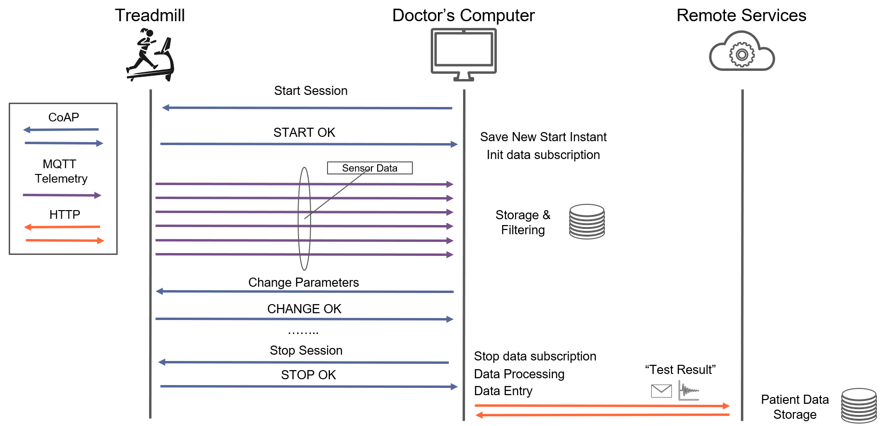

**Figure 9:** Sequence diagram of the interactions between the treadmill, doctor's computer and cloud services with MQTT and CoAP protocols.

In this configuration the CoAP protocol is used for the request/response interactions between the treadmill and the doctor's computer for control commands and session management while the MQTT protocol is used for the telemetry data streaming from the treadmill to the doctor's computer. The HTTP protocol is still used for the interactions between the doctor's computer and the cloud services.

Data Models, MQTT topics and RESTful APIs remains the same as the previous implementation while the CoAP resources and methods are defined as follows where for each CoAP resource the associated methods, attributes and payloads are specified.
With respect to payloads, the Telemetry **SenML+JSON format is used for telemetry** data while a **CUSTOM JSON format is used for actuator commands and device information**.

**Heart Rate Resource**

- **Resource URI**: `/heart_rate`
- **if:** `core.s`
- **rt:** `io.treadmill.heart_rate`
- **obs:** true (to allow observe/notify mechanism for live updates)
- **Telemetry SenML+JSON Payload**:
  ```json
  [
    {
      "n": "io.treadmill.heart_rate",
      "u": "bpm",
      "v": double,
      "t": long
    }
  ]
  ```

**Speed Resource**

- **Resource URI**: `/speed`
- **if:** `core.a`
- **rt:** `io.treadmill.speed`
- **obs:** true (to allow observe/notify mechanism for live updates)
- **Telemetry SenML+JSON Payload**:
  ```json
  [
    {
      "n": "io.treadmill.speed",
      "u": "km/h",
      "v": double,
      "t": long
    }
  ]
  ```
- **Actuator CUSTOM JSON Payload**:
  ```json
  {
    "value": double,
    "unit": "string"
  }
  ```
- **Actuation Interaction**:
  - **PUT** method to set the speed value with the Actuator CUSTOM JSON Payload.
  - **POST** method without payload to trigger a predefined speed adjustment routine (e.g., increase by 1 km/h) or move to a preset speed level (e.g., "warm-up", "peak", "cool-down").

**Incline Resource**
- **Resource URI**: `/incline`
- **if:** `core.a`
- **rt:** `io.treadmill.incline`
- **obs:** true (to allow observe/notify mechanism for live updates)
- **Telemetry SenML+JSON Payload**:
  ```json
  [
    {
      "n": "io.treadmill.incline",
      "u": "degrees",
      "v": double,
      "t": long
    }
  ]
  ```
- **Actuator CUSTOM JSON Payload**:
  ```json
  {
    "value": double,
    "unit": "string"
  }
  ```
- **Actuation Interaction**:
  - **PUT** method to set the incline value with the Actuator CUSTOM JSON Payload.
  - **POST** method without payload to trigger a predefined incline adjustment routine (e.g., increase by 1 degree) or move to a preset incline level (e.g., "warm-up", "peak", "cool-down").

**Device Info Resource**
- **Resource URI**: `/info`
- **if:** `core.p`
- **rt:** `io.treadmill.info`
- **Device Info CUSTOM JSON Payload**:
  ```json
  {
    "id": "string",
    "software_version": "string",
    "manufacturer": "string",
    "device_type": "string"
  }
  ```

**Note**: This CoAP modeling of resources and interactions provides a structured approach to implementing the local communication between the treadmill and the doctor's computer, leveraging CoAP's lightweight nature for efficient IoT device interactions. Use this approach as the **guidelines** and **reference** for your exam projects and written exams.

---

## Protocols & Communication Alternative - CoAP + HTTP

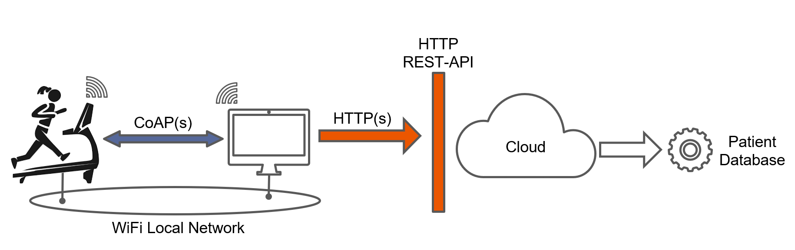

**Figure 10:** Schematic representation of the same scenario implemented with CoAP and HTTP protocols.

The same scenario can be also implemented with a combination of CoAP and HTTP protocols.
In this configuration the CoAP protocol is used for the local interactions between the treadmill and the doctor's computer for both request/response interactions and telemetry data streaming while the HTTP protocol is still used for the interactions between the doctor's computer and the cloud services. The telemetry data streaming can be implemented with **CoAP observe mechanism** where the doctor's computer subscribes to the CoAP resources on the treadmill to receive real-time updates.

**Note**: You can design and write the specifications of this alternative implementation as an exercise.

---

# Scenario 3 - Industrial Remote Telemetry

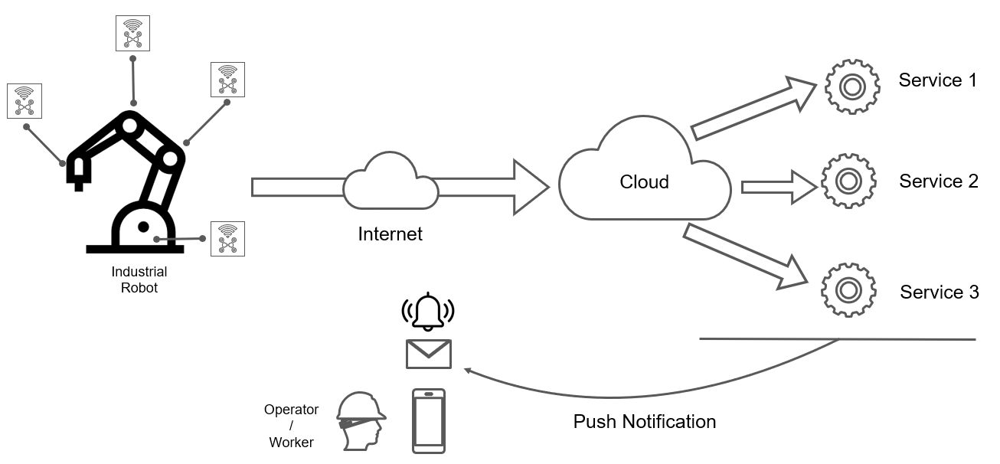

**Figure 11:** Schematic representation of an Industrial Remote Telemetry system with high-level components and interactions.

In this third scenario, an industrial remote telemetry system is considered. 
This scenario depicts an **IoT-enabled industrial monitoring ecosystem** that integrates smart sensors and devices with cloud-based analytics and control systems. 
The system enables real-time monitoring of industrial equipment, integration with maintenance and operational data, and long-term performance analysis.

---

## High-Level Architecture & Main Components

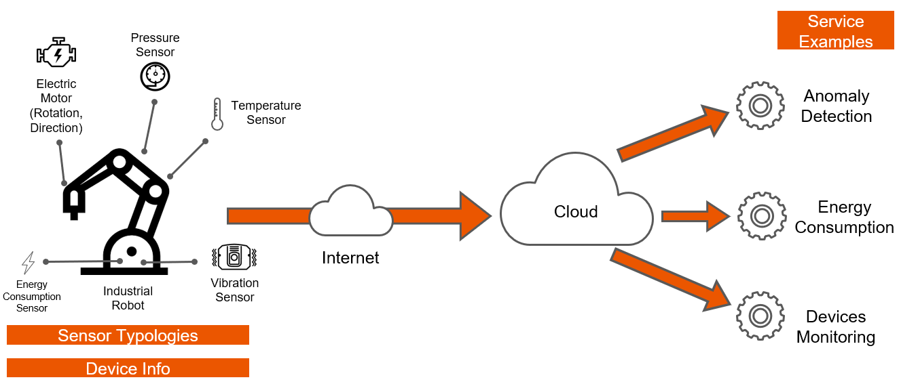

**Figure 12:** Main data categories and flows in the Industrial Remote Telemetry system.

The Figure illustrates an Industrial Remote Telemetry scenario within an IoT architecture. It depicts a connected industrial robot that communicates with multiple cloud-based services over the Internet. These services include anomaly detection, energy consumption monitoring, and device monitoring. 

**- Edge/Local Layer (Industrial Robot)**
  **- Sensors:**
    - Temperature (thermal conditions)
    - Pressure (fluid/gas systems)
    - Electric motor (rotation, direction)
    - Vibration (mechanical health)
    - Energy consumption (power usage)

**- Connectivity Layer**
  - Remote communication between the industrial robot and cloud services via Internet.

**- Analytics & Services**
  - Anomaly Detection Service (real-time alerts) for example based on sensors trends
  - Energy Monitoring Service (usage profiling, efficiency KPIs) to monitor power consumption and optimize energy usage
  - Device Monitoring Service (status, health) to track the overall device health 
  - Notification Service (alerts, maintenance reminders) to send notifications based on analytics results

In this scenario the interactions are similar to the first scenario with publish/subscribe interactions for telemetry data with a unidirectional flow from edge to cloud in 
order to feed the different services with data coming from the industrial robot.

---

## Data Models

**Electric Motor Sensor Data Model**

Captures real-time operational characteristics of the electric motor driving the industrial robot. Used by the Device Monitoring Service for health assessment and by the Anomaly Detection Service for predictive maintenance.

| **Field** | **Type** | **Description** |
|-----------|----------|-----------------|
| `speed` | Double | Rotational speed of the motor (RPM or rad/s) |
| `speed_unit` | String | Unit of measure for speed (e.g., "RPM", "rad/s") |
| `rotation` | Double | Current rotation angle or position (degrees or radians) |
| `rotation_unit` | String | Unit of measure for rotation (e.g., "degrees", "radians") |
| `timestamp` | Long | Unix epoch timestamp (ms) indicating when the reading was taken |

**Pressure Sensor Data Model**

Monitors fluid or gas pressure in industrial systems (hydraulic circuits, pneumatic lines, pressurized chambers). Critical for safety and efficiency in manufacturing and process control.

| **Field** | **Type** | **Description** |
|-----------|----------|-----------------|
| `value` | Double | Pressure measurement |
| `unit` | String | Unit of measure (e.g., "bar", "PSI", "Pa") |
| `timestamp` | Long | Unix epoch timestamp (ms) indicating when the reading was taken |

**Temperature Sensor Data Model**

Monitors thermal conditions of equipment, bearings, motors, and control systems. Essential for preventing overheating failures and optimizing thermal efficiency.

| **Field** | **Type** | **Description** |
|-----------|----------|-----------------|
| `value` | Double | Temperature measurement |
| `unit` | String | Unit of measure (e.g., "Celsius", "Fahrenheit", "Kelvin") |
| `timestamp` | Long | Unix epoch timestamp (ms) indicating when the reading was taken |

**Vibration Sensor Data Model**

Captures mechanical vibration characteristics indicating equipment health and operational quality. Vibration analysis is a leading indicator of mechanical failures.

| **Field** | **Type** | **Description** |
|-----------|----------|-----------------|
| `value` | Double | Vibration amplitude measurement (acceleration, displacement, or velocity) |
| `unit` | String | Unit of measure (e.g., "m/s²", "mm", "mm/s") |
| `timestamp` | Long | Unix epoch timestamp (ms) indicating when the reading was taken |


**Energy Consumption Sensor Data Model**

Tracks electrical power consumption and energy usage of the industrial robot and associated systems. Used by the Energy Monitoring Service for efficiency profiling, cost tracking, and demand management.

| **Field** | **Type** | **Description** |
|-----------|----------|-----------------|
| `value` | Double | Energy consumption measurement |
| `unit` | String | Unit of measure (e.g., "kWh", "Wh", "J") |
| `timestamp` | Long | Unix epoch timestamp (ms) indicating when the reading was taken |

**Device Info Data Model**

Contains metadata about the industrial robot and associated equipment. Used for device fleet management, software updates, warranty tracking, and asset identification.

| **Field** | **Type** | **Description** |
|-----------|----------|-----------------|
| `id` | String | Unique device identifier (UUID or serial number) for the industrial robot |
| `software_version` | String | Firmware/software version (e.g., "3.2.1-industrial") |
| `manufacturer` | String | Equipment manufacturer name (e.g., "FANUC", "ABB", "Siemens") |
| `manufacturer_device_type` | String | Device model and type (e.g., "CRB-6-90-GiD", "M-710ic/50") |

---

## Protocols & Communication

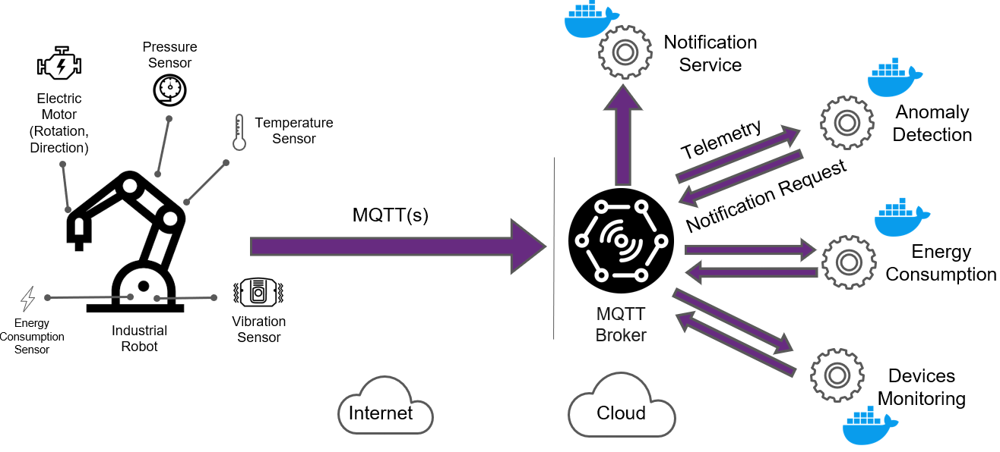

**Figure 13:** Mapping of the MQTT protocol on the target scenario with the broker and the main data flows.

The target scenario in mainly associated to the concept of **Telemetry Data Ingestion** from edge devices to cloud services with a few messages coming from the cloud to the edge associated to 
**notification** messages. In this context, the MQTT protocol is a perfect fit due to its lightweight nature, publish-subscribe model, and efficiency in handling intermittent connectivity common in IoT environments.

The Figure 13 shows how the MQTT protocol can be mapped on the target scenario with the broker and the main data flows. In this case, the MQTT broker can be hosted in the cloud since the main data flows are from the edge to the cloud and edge devices are connected with internet access and the broker can be reached without problems. A deployment where the broker is hosted on the edge could be considered in scenarios where edge devices are connected via local network without internet access or with limited connectivity.

Other protocols could be considered for this scenario such as CoAP or AMQP but MQTT is the most adopted protocol in the IoT industry for telemetry data ingestion scenarios where resource-constrained devices and unreliable networks are common and also data are mainly used for monitoring and analytics purposes by remote cloud services.

---

### MQTT Topics & Data

In this section, the MQTT topics and the associated data payloads for each telemetry type and notification messages are defined. The topics are structured to facilitate easy subscription and filtering by the cloud services.

**Device Info Topic**

- **Topic**: `device/{device_id}/info`
- **Payload**:
  ```json
  {
    "id": "string",
    "software_version": "string",
    "manufacturer": "string",
    "manufacturer_device_type": "string"
  }
  ``` 
- **QoS Level**: 2 (ensures exactly once delivery for critical metadata)
- **Retain Flag**: true (to keep the latest device info available for new subscribers

This setup allows cloud services to subscribe to the device info topic to obtain metadata about the industrial robot.
The QoS level of 2 ensures that the device information is delivered exactly once, which is crucial for accurate device identification and management.
The retain flag is set to true to ensure that the latest device information is always available to cloud services even if they subscribe after the initial publication or a device reboot or application restart.

**Electric Motor Data Topic**

- **Topic**: `device/{device_id}/telemetry/electric_motor`
- **Payload SenML+Json**:
  ```json
  [
    {
      "n": "iot.data.electric_motor.speed",
      "u": "rpm",
      "v": double,
      "t": long
    },
    {
      "n": "iot.data.electric_motor.rotation",
      "u": "degrees",
      "v": double,
      "t": long
    }
  ]
  ```
- **QoS Level**: 0 (high-frequency data where occasional loss is acceptable)
- **Retain Flag**: false (electric motor data is time-sensitive and should not be retained)

This topic configuration allows cloud services to efficiently receive and process electric motor data for real-time monitoring of the industrial robot.
The QoS level of 0 ensures that each electric motor reading is delivered at most once, which is sufficient for high-frequency telemetry data where occasional data loss is acceptable. 
The retain flag is set to false to prevent outdated electric motor data from being sent to cloud services.

**Pressure Data Topic**

- **Topic**: `device/{device_id}/telemetry/pressure`
- **Payload SenML+Json**:
  ```json
  [
    {
      "n": "iot.data.pressure.value",
      "u": "bar",
      "v": double,
      "t": long
    }
  ]
  ```
- **QoS Level**: 1 (balances reliability with performance for high-frequency data)
- **Retain Flag**: false (pressure data is time-sensitive and should not be retained)

This topic configuration allows cloud services to efficiently receive and process pressure data for real-time monitoring of the industrial robot.
The QoS level of 1 ensures that each pressure reading is delivered at least once, which is sufficient for high-frequency telemetry data where occasional duplicates can be handled by idempotent processing. The retain flag is set to false to prevent outdated pressure data from being sent to cloud services. 

**Vibration Data Topic**

- **Topic**: `device/{device_id}/telemetry/vibration`
- **Payload SenML+Json**:
  ```json
  [
    {
      "n": "iot.data.vibration.value",
      "u": "m/s2",
      "v": double,
      "t": long
    }
  ]
  ```
- **QoS Level**: 0 (high-frequency data where occasional loss is acceptable)
- **Retain Flag**: false (vibration data is time-sensitive and should not be retained)

This topic configuration allows cloud services to efficiently receive and process vibration data for real-time monitoring of the industrial robot.
The QoS level of 0 ensures that each vibration reading is delivered at most once, which is sufficient for high-frequency telemetry data where occasional data loss is acceptable. 
The retain flag is set to false to prevent outdated vibration data from being sent to cloud services.

**Temperature Data Topic**

- **Topic**: `device/{device_id}/telemetry/temperature`
- **Payload SenML+Json**:
  ```json
  [
    {
      "n": "iot.data.temperature.value",
      "u": "Cel",
      "v": double,
      "t": long
    }
  ]
  ```
- **QoS Level**: 1 (balances reliability with performance for high-frequency data)
- **Retain Flag**: false (temperature data is time-sensitive and should not be retained

This topic configuration allows cloud services to efficiently receive and process temperature data for real-time monitoring of the industrial robot.
The QoS level of 1 ensures that each temperature reading is delivered at least once, which is sufficient for high-frequency telemetry data where occasional duplicates can be handled by idempotent processing. The retain flag is set to false to prevent outdated temperature data from being sent to cloud services.

**Energy Consumption Data Topic**

- **Topic**: `device/{device_id}/telemetry/energy_consumption`
- **Payload SenML+Json**:
  ```json
  [
    {
      "n": "iot.data.energy_consumption.value",
      "u": "kw/h",
      "v": double,
      "t": long
    }
  ]
  ```
- **QoS Level**: 1 (balances reliability with performance for high-frequency data)
- **Retain Flag**: false (energy consumption data is time-sensitive and should not be retained)

This topic configuration allows cloud services to efficiently receive and process energy consumption data for real-time monitoring of the industrial robot.
The QoS level of 1 ensures that each energy consumption reading is delivered at least once, which is sufficient for high-frequency telemetry data where occasional duplicates can be handled by idempotent processing. The retain flag is set to false to prevent outdated energy consumption data from being sent to cloud services.

**Notification Topic**

- **Topic**: `/notification`
- **Payload**:
  ```json
  {
    "message": "string",
    "timestamp": long
  }
  ```
- **QoS Level**: 2 (ensures exactly once delivery for critical notifications)
- **Retain Flag**: false (notifications are time-sensitive and should not be retained)

This topic allows cloud services to send notification messages related to the industrial robot or associated systems and/or any interested subscribers about critical events, maintenance reminders, or alerts.
The QoS level of 2 ensures that each notification message is delivered exactly once, which is crucial for critical alerts that require guaranteed delivery. 
The retain flag is set to false to ensure that notifications are only delivered when they are relevant and

---

### MQTT Topics & Service Mapping

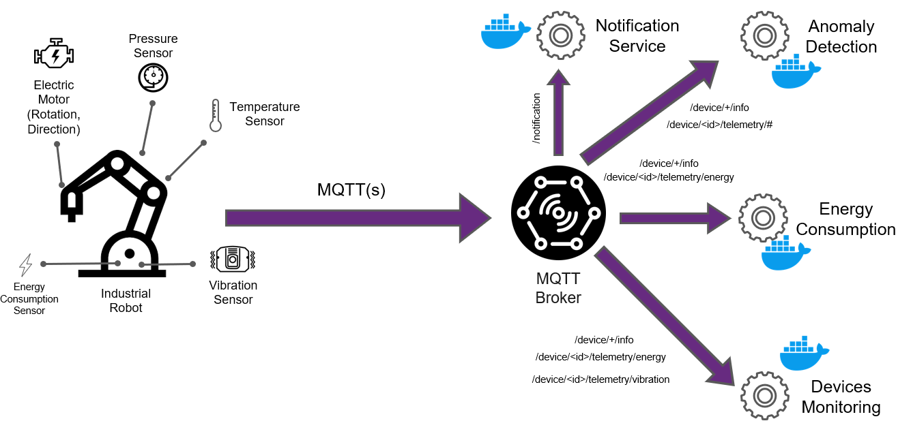

**Figure 14:** Association of the different MQTT topics with the corresponding services in the target scenario.

Once the MQTT topics and their configurations are defined, they can be mapped to the respective microservices in the cloud architecture as shown in Figure.
This mapping is strategic for the scenario design, as it ensures that each microservice subscribes only to the topics relevant to its functionality, optimizing resource usage and processing efficiency.

In particular we have the mapping described and summarized below.

| Topic / Pattern                     | Purpose                               | Publisher                       | Subscriber(s)                 | Notes |
|-------------------------------------|---------------------------------------|---------------------------------|--------------------------------|-------|
| `device/+/info`                     | Device metadata (id, sw, manufacturer) | | Industrial Robot                  | Device Monitoring Service       | Retained for late subscribers |
| `device/<id>/telemetry/#`           | All telemetry from a device            | | Industrial Robot                  | Anomaly Detection, Energy Monitoring, Device Monitoring Services | Use when a service wants all signals |
| `device/<id>/telemetry/electric_motor` | Electric motor data stream            | | Industrial Robot                  | Device Monitoring Service, Anomaly Detection Service | QoS 0; idempotent processing |
| `device/<id>/telemetry/pressure`    | Pressure data stream                  | | Industrial Robot                  | Device Monitoring Service, Anomaly Detection Service | QoS 1; idempotent processing |
| `device/<id>/telemetry/vibration`   | Vibration data stream                 | | | Industrial Robot                  | Device Monitoring Service, Anomaly Detection Service | QoS 0; idempotent processing |
| `device/<id>/telemetry/temperature` | Temperature data stream               | | Industrial Robot                  | Device Monitoring Service, Anomaly Detection Service | QoS 1; idempotent processing |
| `device/<id>/telemetry/energy_consumption` | Energy consumption data stream     | | Industrial Robot                  | Energy Monitoring Service        | QoS 1; idempotent processing |
| `/notification`                     | Notification messages                 | Cloud Services                  | Any interested subscribers | QoS 2 for critical notifications |

---

## Dual-Broker Architecture

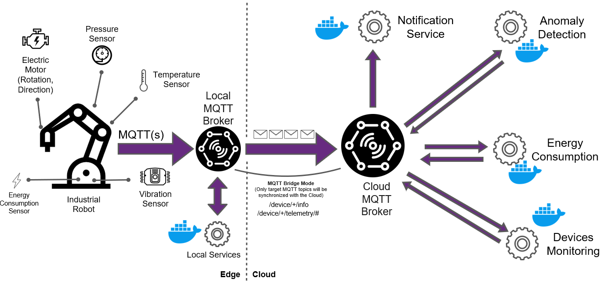

**Figure 15:** The same Industrial Remote Telemetry system with a dual-broker architecture for enhanced reliability and scalability and local processing capabilities.

The same Industrial Remote Telemetry system can be designed with a dual-broker architecture for enhanced reliability and scalability and local processing capabilities as shown in Figure 15.
In this architecture, two MQTT brokers are deployed: one on the edge (local broker) and one in the cloud (cloud broker).
The local broker handles communication between the industrial robot and edge-based applications or services, while the cloud broker manages communication with cloud-based services.
This setup allows for local processing of telemetry data, reducing latency and bandwidth usage, while still enabling cloud-based analytics and storage.

The dual-broker architecture also enhances reliability by providing redundancy in case of network disruptions or broker failures.
If the connection to the cloud broker is lost, the local broker can continue to operate and store telemetry data until the connection is restored.

The two brokers can be synchronized using MQTT bridge mode of existing broker solutions or other synchronization mechanisms to ensure that data is consistently shared between the edge and cloud environments. The synchronization can be configured based on specific topics or data types, allowing for selective data sharing and processing. In this scenario topics that can be used for the synchronization can be for example `device/+/info` and `device/+/telemetry/#` allowing the cloud broker to receive all the telemetry data from the edge devices.